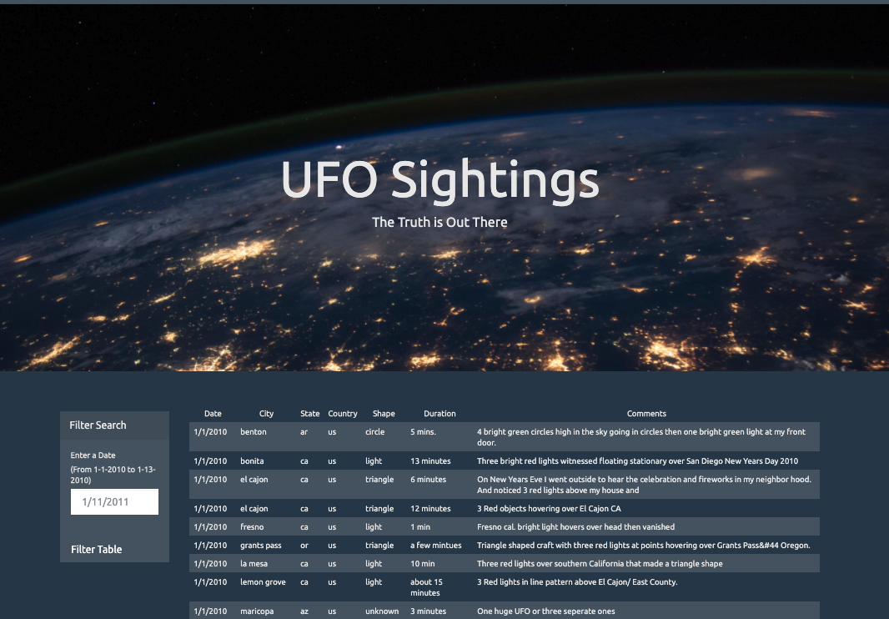
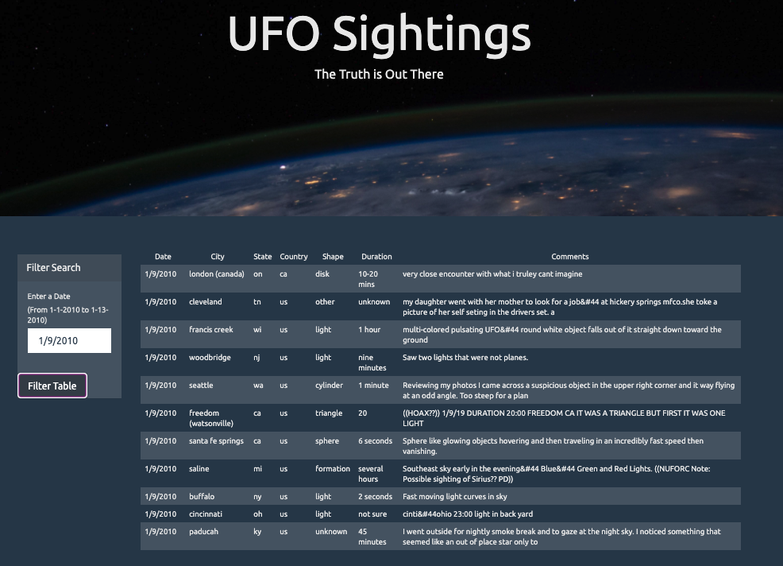
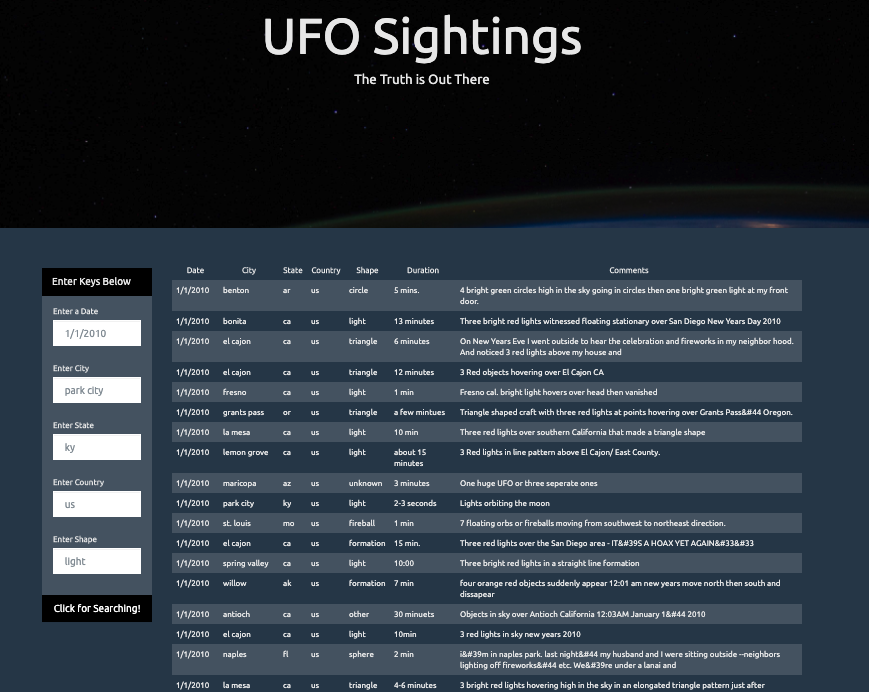
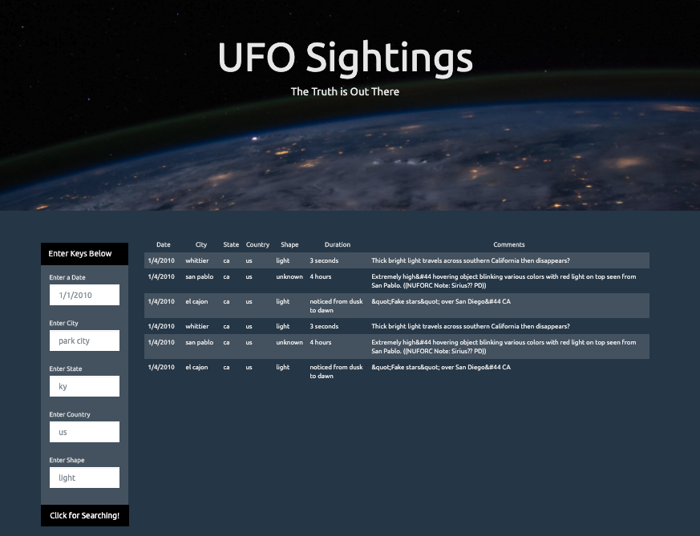

# Javascript-UFO Sighting Project

### Project 1: Automatic Table and Date Search

* Using the UFO dataset provided in the form of an array of JavaScript objects, I wrote code that appended a table to the web page and then added new rows of data for each UFO sighting.

* I used a date form in the HTML document and wrote JavaScript code that showed events and searched through the `date/time` column to find rows that matched user input.
* The website image: Opening page

* The website image: Date Selected Image (1/9/2010)

### Project 2: Multiple Search Categories

* Using multiple `input` tags, I wrote JavaScript code to set multiple filters and searches for UFO sightings using the following criteria based on the table columns:

  1. date
  2. city
  3. state
  4. country
  5. shape

* The website image: Opening page

* The website image: Multiple filters and searches (1/4/2010 & CA)

Enjoy!

